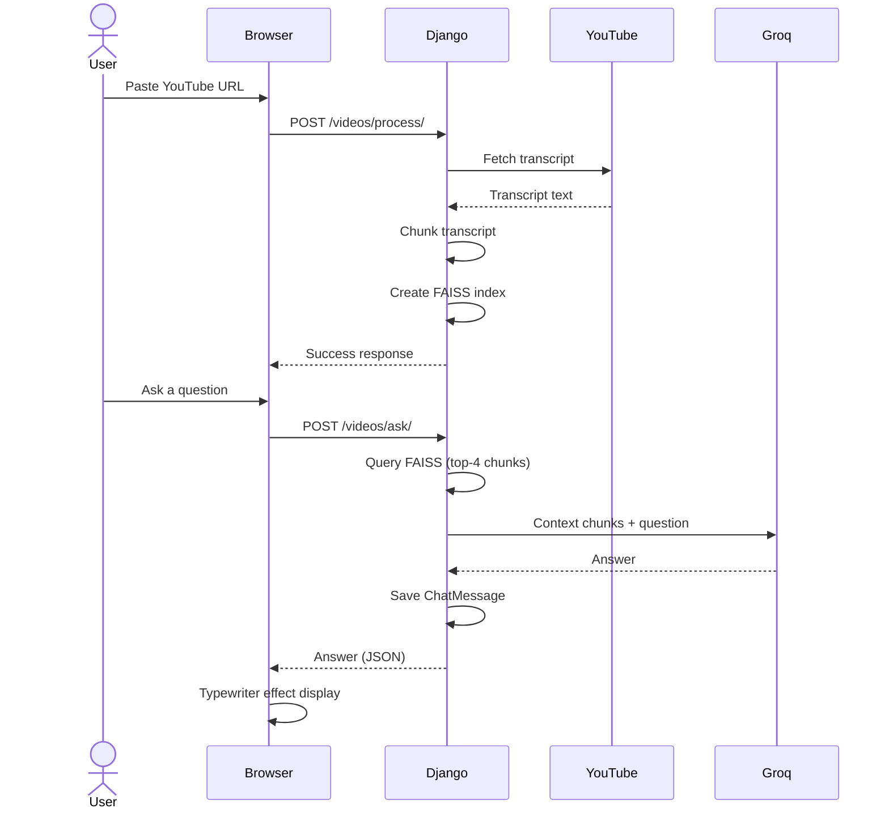

# TubeMind AI

> Turn any YouTube video into an interactive knowledge base — ask questions, get answers grounded in the video transcript.


---

## Overview

TubeMind AI is a **Retrieval-Augmented Generation (RAG)** web application that lets you paste any YouTube video URL and instantly start asking natural-language questions about its content. The system extracts the video transcript, creates vector embeddings, and uses an LLM to answer your questions — with answers grounded **only** in the actual transcript, not general knowledge.

**Try it:** Submit a YouTube URL → AI processes the transcript → Start asking questions about the video.

---

## Features

###  RAG-Powered Q&A
- Ask questions about any YouTube video
- Answers are grounded in the video transcript only — no hallucination
- Typewriter-style streaming response in the UI

### YouTube Processing
- Automatic transcript extraction (English preferred, falls back to any language)
- Text chunking and vector embedding via `sentence-transformers/all-MiniLM-L6-v2`
- FAISS vector index for fast semantic similarity search

### Chat Sessions
- Multiple chat sessions per video
- Dropdown session switcher
- Full chat history preserved and reloadable

### User Dashboard
- Video library with search/filter
- Analytics dashboard (total videos, sessions, questions, storage used)
- Processing status indicators (Ready / Processing / Error)

### Dark Mode
- System-aware initial theme
- Manual toggle with localStorage persistence
- Full Tailwind CSS dark mode support

---

## Tech Stack

| Layer                | Technology                                       |
| -------------------- | ------------------------------------------------ |
| **Backend**          | Django 5.1 + Django REST Framework               |
| **Database**         | SQLite (dev) / PostgreSQL (prod via DATABASE_URL) |
| **LLM**              | Groq — `llama-3.1-8b-instant`                    |
| **Embeddings**       | `sentence-transformers/all-MiniLM-L6-v2`         |
| **Vector Store**     | FAISS (CPU)                                      |
| **Transcripts**      | `youtube-transcript-api`                         |
| **Text Splitting**   | `RecursiveCharacterTextSplitter` (LangChain)     |
| **Frontend**         | Django Templates + Tailwind CSS + Font Awesome   |
| **Deployment**       | Gunicorn / AWS Elastic Beanstalk                 |

---

## Project Structure

```
tubemind/
├── manage.py                 # Django CLI
├── Procfile                  # Gunicorn entry point
├── requirements.txt          # Python dependencies
├── zip.py                    # Deployment packaging script
│
├── tubemind/                 # Django project package
│   ├── settings.py           # Project settings (env-based config)
│   ├── urls.py               # Root URL configuration
│   ├── wsgi.py / asgi.py     # WSGI & ASGI application
│   │
│   ├── accounts/             # User authentication app
│   │   ├── models.py         # CustomUser (bio, avatar, email_verified)
│   │   ├── views.py          # Signup, login, logout + JSON API
│   │   └── urls.py           # /accounts/* routes
│   │
│   ├── core/                 # Landing & dashboard app
│   │   ├── views.py          # Home + dashboard (stats, recent activity)
│   │   └── urls.py           # /, /dashboard/
│   │
│   ├── videos/               # Core video & chat app
│   │   ├── models.py         # Video, Transcript, ChatSession, ChatMessage, etc.
│   │   ├── views.py          # Video list, detail, process, ask, chat history
│   │   └── urls.py           # /videos/* routes
│   │
│   └── services/             # Business logic (not a Django app)
│       └── youtube_service.py # YouTubeProcessingService (singleton)
│
├── templates/                # Django templates
│   ├── base.html             # Main layout (nav, dark mode, Tailwind)
│   ├── core/
│   │   ├── home.html         # Landing page
│   │   └── dashboard.html    # User dashboard
│   └── videos/
│       ├── video_list.html   # Video library grid
│       ├── video_detail.html # Player + transcript + chat UI
│       └── chat_history.html # Read-only chat log
│
└── media/
    └── vector_stores/        # FAISS indexes (created at runtime)
```

---

## Quick Start

### Prerequisites

- Python 3.12+
- [Groq API key](https://console.groq.com)

### Installation

```bash
# Clone the repository
git clone https://github.com/yourusername/tubemind.git
cd tubemind

# Create and activate a virtual environment
python -m venv venv
.\venv\Scripts\activate   # Windows

# Install dependencies
pip install -r requirements.txt

# Environment configuration
# Create a .env file in the project root:
echo SECRET_KEY=your-django-secret-key > .env
echo GROQ_API_KEY=your-groq-api-key >> .env
echo DEBUG=True >> .env

# Run migrations and start the server
python manage.py migrate
python manage.py runserver
```

Open **http://localhost:8000** in your browser. Sign up, paste a YouTube URL, and start asking questions!

### Environment Variables

| Variable       | Required | Default   | Description                      |
| -------------- | -------- | --------- | -------------------------------- |
| `SECRET_KEY`   | Yes      | —         | Django secret key                |
| `GROQ_API_KEY` | Yes      | —         | Groq API key for LLM access      |
| `DEBUG`        | No       | `False`   | Django debug mode                |
| `DATABASE_URL` | No       | SQLite    | PostgreSQL connection string     |
| `ALLOWED_HOSTS`| No       | `*`       | Comma-separated allowed hosts    |

---

## API Endpoints

### HTML Endpoints

| Method | Path                          | Auth     | Description              |
| ------ | ----------------------------- | -------- | ------------------------ |
| GET    | `/`                           | Public   | Landing page             |
| GET    | `/dashboard/`                 | Login    | User dashboard           |
| GET    | `/videos/`                    | Login    | Video library            |
| GET    | `/videos/<uuid:pk>/`          | Login    | Video detail + chat UI   |
| GET    | `/videos/chat/<uuid:pk>/`     | Login    | Full chat history        |
| GET    | `/accounts/login/`            | Public   | Login form               |
| GET    | `/accounts/signup/`           | Public   | Signup form              |

### JSON API Endpoints

| Method | Path                                           | Auth  | Description                  |
| ------ | ---------------------------------------------- | ----- | ---------------------------- |
| POST   | `/accounts/api/signup/`                        | No    | Create user                  |
| POST   | `/accounts/api/login/`                         | No    | Login (session-based)        |
| POST   | `/videos/process/`                             | Login | Submit YouTube URL           |
| POST   | `/videos/ask/`                                 | Login | Ask a question about a video |
| GET    | `/videos/chat/messages/<uuid:session_id>/`     | Login | Get chat messages            |

---

## How It Works



1. **Submit URL** — User pastes a YouTube URL; Django fetches the transcript.
2. **Embed** — Transcript is split into chunks and embedded into a FAISS vector index.
3. **Ask** — User asks a question; the top-4 most relevant chunks are retrieved.
4. **Answer** — Chunks + question are sent to Groq's LLM; answer is grounded in transcript only.
5. **Display** — Response is streamed to the UI with a typewriter effect.

---

## Deployment

### Heroku / AWS Elastic Beanstalk

```bash
# The project includes a Procfile for gunicorn:
#   web: gunicorn tubemind.wsgi --bind 0.0.0.0:8000

# Package the project:
python zip.py

# Deploy to AWS Elastic Beanstalk (after zip):
aws s3 cp tubemind.zip s3://tubemind/tubemind.zip
```

**Important:** Set environment variables (`SECRET_KEY`, `GROQ_API_KEY`, `DATABASE_URL`, `ALLOWED_HOSTS`) in your hosting environment.

---

## Models Overview

| Model              | Description                             |
| ------------------ | --------------------------------------- |
| `CustomUser`       | Extended user (bio, avatar, verified)   |
| `Video`            | YouTube video metadata + processing     |
| `Transcript`       | Full transcript text per video          |
| `ChatSession`      | Group of messages for a video           |
| `ChatMessage`      | Individual user/AI exchange            |
| `EmbeddingMetadata`| Chunk reference for vector store        |
| `APIUsageLog`      | API call logging (extensible)           |

---

## Roadmap

- [ ] JWT authentication for API clients
- [ ] Admin dashboard — register all models
- [ ] Unit tests for views and services
- [ ] Rate limiting and API key management
- [ ] Support for multiple LLM providers
- [ ] Batch processing and queue system
- [ ] Export chat sessions (PDF / JSON)

---

## License

This project is open source under the MIT License.

---

<p align="center">Built with Django, LangChain, FAISS & Groq</p>
